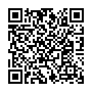

# GoMarket

A private multi-vendor marketplace written in Go.

**🔗 Demo:** [go-market.dev](https://go-market.dev) (connected to Monero stagenet)

## Project Overview

GoMarket is a privacy-focused multi-vendor marketplace written in Go. It includes wallets and invoices, escrow, dispute resolution, vendor licenses and much more. Works with strict browser security settings.

⚠️ **Under construction**
This software is in alpha stage and is missing necessary features and requires more review and testing.

**Key Highlights:**
- **Monero-native payments** - Privacy-focused transactions via Moneropay integration
- **Multi-vendor support** - Complete marketplace infrastructure with vendor applications
- **Wallets and invoices** - Both wallets and "walletless" payments supported
- **Zero JavaScript architecture** - Enhanced security, works with JS disabled
- **Localized** - Supports multiple languages and currencies
- **Mobile friendly UI**
- **Built with Go** - Leveraging Go's performance, safety, and simplicity

## Key Features

**Marketplace Core:**
- Multi-vendor marketplace with vendor licenses
- Product listings with price tiers and categories
- Shopping carts

**Payment & Escrow:**
- Monero payments via Moneropay integration
- Both wallet and walletless payments.
- Built-in escrow system with order flow: pending → paid → accepted → dispatched → finalized/disputed → settled

**Security & Privacy:**
- Zero JavaScript
- Optional PGP-based 2FA
- Optional CAPTCHA protection
- Optional Phishing guard

**Communication & Dispute Resolution:**
- Order chat system for buyer-vendor communication
- Dispute resolution without admin intervention with refund offers

**Infrastructure:**
- S3-compatible storage for horizontal scalability
- Automated translation system based on gotext

## Architecture

GoMarket follows clean architecture principles:

**Layered Structure:**
```
Repository Layer (sqlc) → Service Layer → Application Layer
```

**Technology Stack:**
- **Backend:** Go with Chi router
- **Database:** PostgreSQL with sqlc for type-safe queries
- **Templating:** templ for compile-time HTML generation to Go code
- **Migrations:** go-migrate for database version control
- **Storage:** S3-compatible object storage
- **Payments:** Moneropay payment processor

## Prerequisites

**Required:**
- Go 1.24.4
- PostgreSQL 13+
- S3-compatible storage
- Moneropay

**Optional (for quick start):**
- Docker and Docker Compose

## Quick Start

GoMarket includes `docker-compose.yml` and `.env.example` for rapid test deployment.

**Step-by-step:**

1. **Clone the repository**
   ```bash
   git clone https://github.com/yourusername/gomarket.git
   cd gomarket
   ```

2. **Configure environment**
   ```bash
   cp .env.example .env
   # Edit .env with your configuration
   ```

3. **Start services**
   ```bash
   docker-compose up -d
   ```

4. **Access the marketplace**
   ```
   http://localhost:4000
   ```

## Important Disclaimers

⚠️ **SECURITY NOTICE**

This project is provided for **educational and research purposes only**.

**This software has NOT been security audited** Do not assume it is secure. Deploying to production is not advised as it may result in a loss of funds.

⚠️ **LEGAL NOTICE**

This software is designed for **legitimate applications only**. It is not intended, designed, or suitable for any illegal activities. Users are solely responsible for ensuring their use complies with all applicable laws and regulations in their jurisdiction.

The developers do not condone, support, or take responsibility for any misuse of this software.

## License

This project is licensed under the MIT License - see the [LICENSE](LICENSE) file for details.

## Contributing

Contributions are welcome!

**Ways to contribute**
- Test and provide feedback
- Report bugs and security issues (responsibly)
- Write documentation
- Submit pull requests

**Support development**
- XMR: `82gQdEdeftLC4hDUPfMkFs4XyY3Qax5NCMbSy5UjnSpgHLfaxqBT6voBvhTaBhksvtVQj5zpzxh5X4p3W2VrsTgM9EkRJ96`
<div>
    
</div>

## Contact & Links

**Contacts:**
- Session: `059572d20e3da1c8c6f19655c93cf515a50cf6d62e324c6bff089a3d0f8bdc5a27`
- Email: gobugger (at) proton.me

**Resources:**
- 🌐 **Demo:** [go-market.dev](https://go-market.dev) (stagenet)

**Related Projects:**
- [Moneropay](https://gitlab.com/moneropay/moneropay) - Payment processor

**Built with ❤️ for the Monero community**
