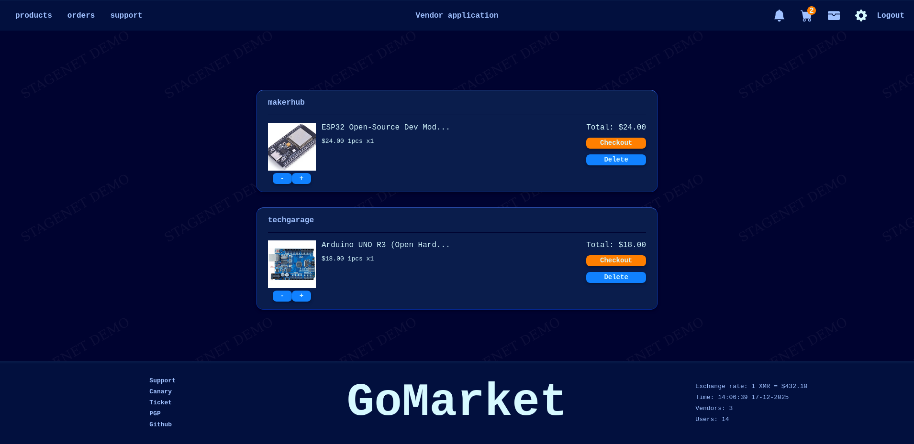
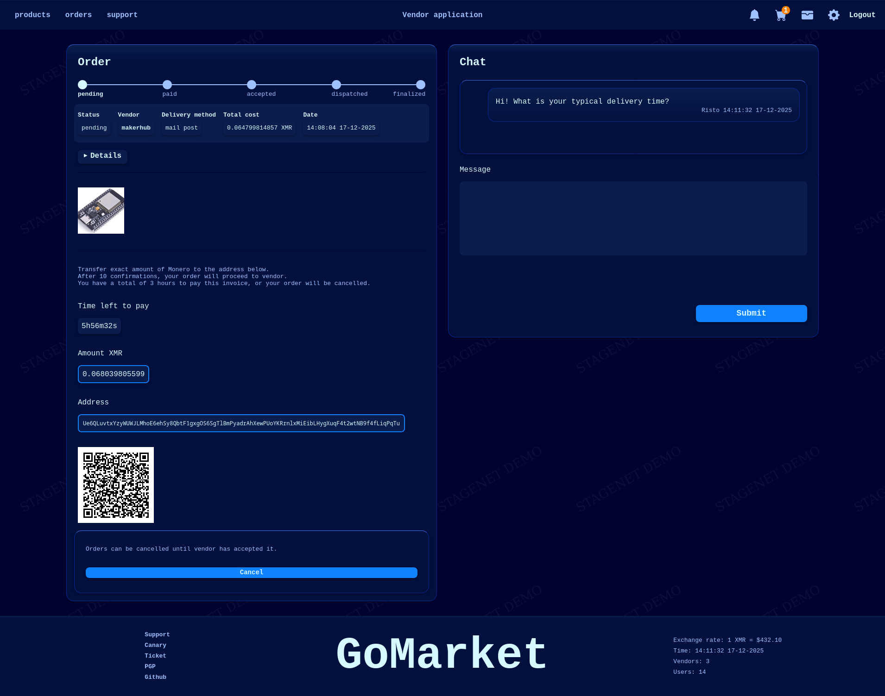
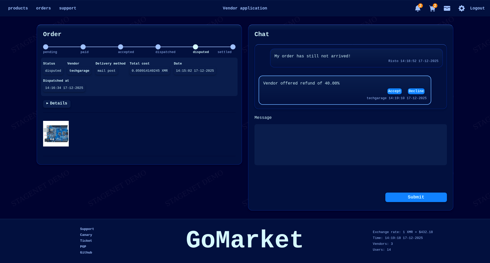

# GoMarket

A multi-vendor marketplace built with Go and PostgreSQL.

<p align="center">
    
    
    
    
</p>

**🔗 Demo:** [go-market.dev](https://go-market.dev) (connected to Monero stagenet)

## Project Overview

GoMarket is a multi-vendor marketplace built with Go and PostgreSQL.

⚠️ **Under construction**
This software is in pre-alpha stage, so features are incomplete and bugs are expected.

**Key Highlights:**
- **Multi-vendor support** - Complete marketplace infrastructure with vendor applications
- **Wallets and invoices** - Both wallets and "walletless" payments supported
- **Nano-support** - Sub-second & zero-fee transactions via Nano integration
- **Monero-support** - Private transactions via Moneropay integration
- **Localized** - Supports multiple languages and currencies
- **Mobile friendly UI**
- **Built with Go** - Leveraging Go's performance, safety, and simplicity
- **Optional enhanced privacy features** - PGP-based 2FA, zero javascript, custom capcha, phishing protection/entry guard

## Key Features

**Marketplace Core:**
- Multi-vendor marketplace with vendor licenses
- Product listings with price tiers and categories
- Shopping carts

**Payment & Escrow:**
- Nano or Monero payments
- Both wallet and walletless payments.
- Built-in escrow system with order flow: pending → paid → accepted → dispatched → finalized/disputed → settled

**Security & Privacy:**
- Zero JavaScript
- Optional PGP-based 2FA
- Optional CAPTCHA protection
- Optional Phishing protection/entry guard

**Communication & Dispute Resolution:**
- Order chat system for buyer-vendor communication
- Dispute resolution without admin intervention with refund offers

## Architecture

This software is built from scratch and was inspired by the book "Let's Go" by Alex Edwards.

**Layered Structure:**
```
Repository Layer (sqlc) -> Service Layer -> Application Layer <- Views Layer
```

**Technology Stack:**
- **Backend:** Go with Chi router
- **Database:** PostgreSQL with sqlc for type-safe queries
- **Templating:** templ for compile-time HTML generation to Go code
- **Migrations:** go-migrate for database version control
- **Storage:** S3-compatible object storage
- **Payments:** Nano or Monero

## Prerequisites

**Required:**
- Go 1.24.4
- PostgreSQL 13+
- S3-compatible storage
- Moneropay

**Optional (for quick start):**
- Docker and Docker Compose

## Quick Start

GoMarket includes `docker-compose.yml` and `.env.example` for rapid test deployment.

**Step-by-step:**

1. **Clone the repository**
   ```bash
   git clone https://github.com/yourusername/gomarket.git
   cd gomarket
   ```

2. **Configure environment**
   ```bash
   cp .env.example .env
   # Edit .env with your configuration
   ```

3. **Start services**
   ```bash
   docker-compose up -d
   ```

4. **Access the marketplace**
   ```
   http://localhost:4000
   ```

## Important Disclaimers

⚠️ **SECURITY NOTICE**

This project is provided for **educational and research purposes only**.

**This software has NOT been security audited** Do not assume it is secure. Deploying to production is not advised as it may result in a loss of funds.

⚠️ **LEGAL NOTICE**

This software is designed for **legitimate applications only**. It is not intended, designed, or suitable for any illegal activities. Users are solely responsible for ensuring their use complies with all applicable laws and regulations in their jurisdiction.

The developers do not condone, support, or take responsibility for any misuse of this software.

## License

This project is licensed under the MIT License - see the [LICENSE](LICENSE) file for details.
