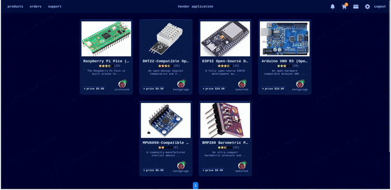

# GoMarket

A multi-vendor marketplace written in Go.

<p align="center">
    
</p>

**🔗 Demo:** [go-market.dev](https://go-market.dev) (connected to Monero stagenet)

## Project Overview

GoMarket is a multi-vendor marketplace written in Go without frameworks.

⚠️ **Under construction**
This software is in pre-alpha stage, so features are incomplete and bugs are expected.

**Key Features:**
- **Multi-vendor support** - Complete marketplace infrastructure with vendor applications
- **Wallets** - Each user has a wallet with deposit and withdraw functionality
- **Invoices** - Orders can be paid directly with an invoice
- **Nano(XNO) and Monero(XMR) supported** - Choose between convenience and privacy
- **Localized** - Supports multiple languages and currencies
- **Mobile friendly UI** - Scales to screens of any size
- **Order chat** - Order chat system for buyer-vendor communication
- **Dispute resolution without without admin intervention** - Vendor can create refund offers to buyer in order chat
- **Optional enhanced privacy features** - PGP-based 2FA, zero javascript, custom capcha, phishing protection/entry guard

## Architecture

This software is built from scratch and was inspired by the book "Let's Go" by Alex Edwards.

**Layered Structure:**
```
Handlers
------------------------
Services | Views
------------------------
Repository (sqlc)
------------------------
```

**Technology Stack:**
- **Backend:** Go with Chi router
- **Database:** PostgreSQL with sqlc for type-safe queries and clean repository layer
- **Templating:** templ for compile-time HTML generation to Go code
- **Migrations:** go-migrate for database version control
- **Storage:** S3-compatible object storage
- **Payments:** Nano or Monero

## Prerequisites

**Required:**
- Go 1.24.4
- PostgreSQL 13+
- S3-compatible storage
- NanoNode or Moneropay

**Optional (for quick start):**
- Docker and Docker Compose

## Quick Start

GoMarket includes `docker-compose.yml` and `.env.example` for rapid test deployment.

**Step-by-step:**

1. **Clone the repository**
   ```bash
   git clone https://github.com/yourusername/gomarket.git
   cd gomarket
   ```

2. **Configure environment**
   ```bash
   cp .env.example .env
   # Edit .env with your configuration
   ```

3. **Start services**
   ```bash
   docker-compose up -d
   ```

4. **Access the marketplace**
   ```
   http://localhost:4000
   ```

## License

This project is licensed under the MIT License - see the [LICENSE](LICENSE) file for details.
